 

  

 

##  🚀 About  Me

I'm a 3rd-year Computer Science Engineering student at **Panimalar Engineering College** (Anna University), Chennai. I'm building a strong foundation in core CS concepts and enjoy turning ideas into working software. Currently exploring AI tools and cloud basics alongside my coursework.

- 🔭 Focused on strengthening **DSA, DBMS, OS, and OOP** fundamentals and technologies
- 🌱 Currently exploring **AWS basics** and AI productivity tools
- 🤝 Looking to collaborate on beginner-friendly and open-source projects
- 🎤 Presented technical papers at IEEE and national-level tech fests
- 📍 Tenkasi, Tamil Nadu, India
- 📫 **yogesh20022007@gmail.com**

 

## 🛠️ Tech Stack

  
  
  
  
  
  
  
  
  
  
  

 

## 📊 GitHub Stats

  

 

## 📊 GitHub Stats and Activity

    

 

## 🐍 Contribution Snake

<picture>
  <source media="(prefers-color-scheme: dark)" srcset="https://raw.githubusercontent.com/yogesh20-02/yogesh20-02/output/github-contribution-grid-snake-dark.svg">
  <source media="(prefers-color-scheme: light)" srcset="https://raw.githubusercontent.com/yogesh20-02/yogesh20-02/output/github-contribution-grid-snake.svg">
  
</picture>

 

## 🎯 Highlights

- 🗣️ Paper Presentation – **Kurukshetra'26 (IEEE)**, Anna University
- 🗣️ Paper Presentation – **TEXUS'26**, SRM Institute of Science and Technology
- 🏭 Industrial Visit – **Redback IT Solutions Pvt. Ltd.**, Vellore
- 🥈 2nd Place – **Thulir Science Talent Test** (District Level)
- 💡 Idea Submission – **Student Innovation & Development Program (SIDP)**

 

## 🌐 Connect with Me

 

  <i>"Continuous learning and problem-solving drive everything I build."</i>

